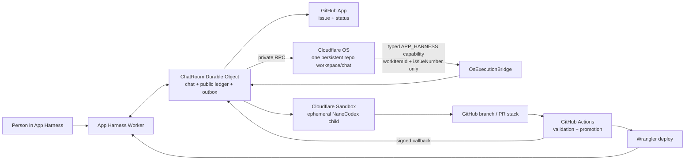

# Architecture map

App Harness separates the persistent operator from disposable implementation jobs and deterministic delivery gates.

## Components

| Component | Responsibility |
| --- | --- |
| [App Harness](https://autonomous-live-chat.coda-a.workers.dev) | Minimal chat, contextual overlay, WebSocket updates, and public artifact links. |
| ChatRoom Durable Object | Original request authority; issue/stack records; idempotent outbox; retries; truthful lifecycle. |
| [Cloudflare OS Workshop](https://app-harness-os.coda-a.workers.dev) | Persistent repository operator context, agent conversation, resources, and Gatekeeper capabilities. |
| App Harness custom Gatekeeper | Adds one typed `enqueueRepositoryTask` capability; it cannot carry source, prompts, commands, repository selection, or credentials. |
| `OsExecutionBridge` | Capability-only exported Worker entrypoint. It verifies the work item/issue against durable state and queues the deterministic pipeline. It has no public HTTP route. |
| [Native Git Sandbox runner](https://app-harness-os-native-git.coda-a.workers.dev) | Creates a disposable checkout and runs a bounded NanoCodex implementation child with native engineering tools. |
| Git credential proxy + GitHub App | Mints short-lived installation credentials scoped to this repository. The private key never enters the Sandbox. |
| Stack ledger + GitHub Actions | Verifies branch/PR provenance, handles ordered stacks/restacks, runs unprivileged checks, merges, deploys, and signs completion evidence. |

## Persistence and idempotency

The OS workspace key is the repository and the chat key is `repository-main`, so operator context survives individual tasks. The work-item UUID is the external message key and the callback correlation key. The existing room creates the callback with Cloudflare's `ctx.restore()` primitive; no callback Worker or second Durable Object is involved, and OS can redeliver the response safely after restarts. The Gatekeeper capability can also be retried safely: the Durable Object creates exactly one fixed `observe-main` effect for the work item.

The NanoCodex implementation child is intentionally not persistent. It receives the current checkout and task, can parallelize read-only investigation with built-in subagents, and disappears after leaving independently verifiable Git artifacts. This keeps long-term context in OS and task execution isolated.

## Trust boundaries

| Boundary | Mechanism |
| --- | --- |
| Person → Workshop | Cloudflare Access account-member policy. |
| App Harness → OS | Private service-binding RPC to `ExternalMessageGateway`; no shared HTTP bearer secret. |
| OS → App Harness execution | Custom Gatekeeper → private `OsExecutionBridge` RPC, fixed props, two bounded identifiers. |
| App Harness → runner | Private service binding plus the runner’s existing bounded job contract. |
| Runner → GitHub | Process-scoped GitHub App installation credential; no App private key in the child. |
| Candidate → merge/deploy | Unprivileged CI, immutable SHAs, stack generation, one promotion lock, signed callback. |

## Stack and CI policy

A truly atomic change may use one root PR. Dependent slices use one ordered stack: a root `main` base SHA, immediate parent branches, and one generation. When `main` advances, the root restacks once and descendants regenerate from their parent; PRs do not independently auto-rebase in a loop. A failed or closed lower node blocks its descendants. Only authenticated CI/deployment evidence can mark a work item complete.

## Pluggable provider seams

The demo keeps four narrow provider interfaces so infrastructure can change without rewriting the product loop. Only the **current** column is implemented; later options are research notes, not live claims.

| Seam | Current | Possible later provider | Status |
| --- | --- | --- | --- |
| `WorkspaceProvider` | Cloudflare Sandbox-backed OS workspace + ephemeral child | [`@cloudflare/computer`](https://blog.cloudflare.com/cloudflare-computer/) | Cloudflare Computer is preview/early-access; evaluate when its persistent computer/runtime contract is appropriate. |
| `SourceProvider` | GitHub App + Git smart HTTP + GitHub PR stacks | Cloudflare Artifacts | Private beta/future option; do not imply App Harness can leave GitHub today. |
| `CiProvider` | GitHub Actions | [`@cloudflare/ci` on Workflows](https://blog.cloudflare.com/ci-workflows/) | Future option. Cloudflare’s CI primitives are promising for programmable workflow-native jobs but are not this demo’s current verifier. |
| `DeployProvider` | GitHub Actions + Wrangler | Cloudflare CI deploy primitives | Future option, gated on equivalent immutable provenance and signed completion evidence. |

Cloudflare’s [CI Workflows article](https://blog.cloudflare.com/ci-workflows/) is the specific research note for a future GitHub-independent source/CI/deploy plane. A migration must preserve ordered-stack semantics or replace them with an equally explicit dependency graph; vendor novelty is not a reason to weaken the truth contract.

## Truth contract

Code, config, or a successful checkout alone is not end-to-end proof. The production path is proven only by a fresh request that yields the public issue, accepted persistent OS turn, audited capability call, candidate PR/stack, passing CI, merge, deployment, signed callback, and visible live result. The UI must display the last verified state when any later edge fails.
