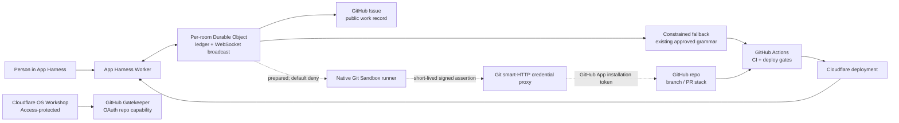

# Architecture map

App Harness is deliberately split into a durable public surface, capability-scoped execution services, and independent promotion gates. The diagram names the components that exist today; arrows marked **prepared** are not yet an enabled production execution path.

## What is running, and what is not

| Component | State | Responsibility |
| --- | --- | --- |
| [App Harness](https://autonomous-live-chat.coda-a.workers.dev) | Live | Minimal chat, annotation intake, durable work ledger, shared updates, GitHub issue/status links, and the constrained fallback. |
| App Harness Worker + per-room Durable Object | Live | The Durable Object is the authority for safe target/provenance, lifecycle events, public activity, and what the UI may truthfully say. |
| GitHub Issues + Actions | Live | Each request is handed off to an issue. The existing allowlisted fallback can make a candidate PR and rely on CI/deploy gates; it is not an intelligent coding agent. |
| [Cloudflare OS Workshop](https://app-harness-os.coda-a.workers.dev) | Live | Access-protected workshop with the configured Cloudflare-native identity and an attached GitHub Gatekeeper connection. It is not yet the production executor for App Harness requests. |
| GitHub Gatekeeper | Connected | A separate OAuth capability for the Workshop. It is not the Git credential used by a Sandbox job. |
| [Native Git Sandbox runner](https://app-harness-os-native-git.coda-a.workers.dev) | Live, fail-closed | A remotely built Cloudflare Sandbox Worker. Its authenticated probe has run `git --version` in an isolated Sandbox. Native checkout remains disabled until the credential bridge is complete. |
| Git smart-HTTP credential proxy | Prepared, not deployed | Default-deny proxy that only accepts the one permitted repository and Git smart-HTTP paths, then mints a short-lived GitHub App installation token server-side. |
| App Harness → OS provider seam | Prepared, disabled | A bounded durable work item can be translated into an OS job only when the provider switch and runner secret are explicitly enabled. It never forwards raw user prose as shell. |

The verified runner deployment is [GitHub Actions run 31105808078](https://github.com/callil/autonomous-live-chat/actions/runs/31105808078): version `a5af102a-d4ad-4025-8c1e-afd5bbf5c5f8` returned `git version 2.34.1` from Cloudflare Sandbox. That is evidence of remote Sandbox execution only—not evidence of a clone, edit, push, PR, model run, or production change by the agent.

## Trust and secret boundaries

The design uses separate credentials for separate jobs. Secret values are never placed in the Durable Object, browser, annotation envelope, Sandbox command log, or this repository.

| Boundary | Mechanism | Scope |
| --- | --- | --- |
| Person → Workshop | Cloudflare Access account-member policy | Interactive Workshop access only. |
| Workshop → GitHub Gatekeeper | GitHub OAuth app connection | Workshop/Gatekeeper resource authorization only; not native Git. |
| App Harness → Sandbox runner | `APP_HARNESS_RUNNER_SECRET` | Authenticates the bounded runner endpoint. |
| Sandbox runner → credential proxy | `GIT_PROXY_ASSERTION_SECRET` | HMAC assertion with a short expiry, exact repository, job ID, and stack generation. |
| Credential proxy → GitHub | GitHub App private key → installation token | The proxy mints a short-lived installation token only for `callil/autonomous-live-chat`; the Sandbox receives only the temporary assertion, never the private key. |
| GitHub Actions → Cloudflare | `CLOUDFLARE_API_TOKEN` | Remote Docker/Wrangler build and deployment, keeping container construction off the laptop. |

The native-Git GitHub App has not been created/installed yet. When it is, the GitHub repository must receive these secret names: `APP_HARNESS_GITHUB_APP_ID`, `APP_HARNESS_GITHUB_APP_INSTALLATION_ID`, and `APP_HARNESS_GITHUB_APP_PRIVATE_KEY`. The Worker-facing secret names stay internal (`GITHUB_APP_ID`, `GITHUB_APP_INSTALLATION_ID`, `GITHUB_APP_PRIVATE_KEY`). GitHub rejects repository secret names beginning with `GITHUB_`, hence the `APP_HARNESS_` prefix.

## Deployment order

1. Create a dedicated GitHub App, install it **only** on `callil/autonomous-live-chat`, and grant only Contents read/write, Pull requests read/write, and Metadata read-only. Disable webhooks. Generate a private key; record the App ID and installation ID without committing any of them.
2. Store the three repository secrets above. `GIT_PROXY_ASSERTION_SECRET` is already an independent shared secret between the runner and proxy.
3. Run the repository’s remote GitHub Actions deployment for the credential proxy. It builds/deploys remotely and writes Worker secrets by stdin; verify the deployed proxy is still default-deny for every other repository/path.
4. Run the remote runner deployment so it has the matching assertion secret. Enable native checkout only after the proxy responds correctly for its signed, exact-repository request.
5. Install `OS_NATIVE_GIT_RUNNER_SECRET` on the App Harness Worker, then explicitly enable the App Harness OS provider. Until then its configuration remains disabled and the Durable Object reports a review/blocked state rather than pretending a job started.
6. Exercise one controlled request and collect each artifact: issue, durable ledger event, runner audit events, branch/PR (or stack), CI run, deployment, and visible live result.

Deploy the Workshop, runner, proxy, and App Harness independently. A Workshop-only deployment must not reset the separate GitHub Gatekeeper Durable Object.

## Stack and CI policy

The system uses a direct one-PR path only for a truly atomic change. A multi-slice change uses a real ordered GitHub stack:

- A root branch records one `main` base SHA. Each descendant is based on its immediate parent, never independently on `main`.
- The Durable Object ledger records the root issue, parent/child PR links, intent slice, base SHA, stack generation, lane, and honest `needs-restack` or `blocked` state.
- When `main` advances, the scheduler restacks the root once and regenerates descendants deterministically. Descendants do not run their own auto-rebase loop.
- CI concurrency is keyed to the stack generation; stale generation runs are cancelled. A failed or closed lower PR blocks every descendant.
- Unrelated work uses bounded separate lanes. No PR is presented as deployed merely because an ancestor or sibling deployed.

The scheduler and its tests live with the App Harness source; the policy exists to prevent concurrent autonomous PRs from repeatedly overtaking one another, becoming stale, and consuming CI indefinitely.

## Truth contract

The visible app is event-driven: it may show **issue created**, **agent started**, **candidate branch created**, **CI validating**, **deployed**, **needs review**, or **external handoff failed** only after the matching external or durable event exists. A target/comment/drawing is always acknowledged as intake; arbitrary freeform notes are not represented as a coding-agent run. The current closed loop is real only for approved fallback grammar. The Cloudflare OS/native Git path is intentionally labeled prepared/blocked until its GitHub App trust chain and execution artifacts are verified.

## Remaining end-to-end proof

1. Complete the dedicated GitHub App installation and deploy the credential proxy with its three secret values.
2. Prove a signed runner checkout against the allowlisted repository, including the proxy audit record; then implement/enable the bounded edit, diff inspection, commit, push, and PR creation steps.
3. Select the OS provider for one policy-eligible controlled request and prove its durable issue → runner → native branch/PR (or ordered stack) → CI → deployment event chain.
4. Inspect the resulting production UI and attach the issue, PR, CI, deployment, and live URLs to the public activity record.

Until all four are complete, no documentation or UI should describe a model-driven native Git agent as live.
