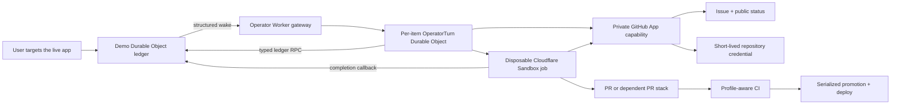

# Architecture

## Four code surfaces

| Surface | Owns | Does not own |
| --- | --- | --- |
| `apps/demo` | Chat UI, room protocol, Worker routes, Durable Object state, product deployment | Reusable React API or isolated Git credentials |
| `packages/contracts` | Provider-derived limits, delivery policy, sanitized authoring-envelope schema | Product behavior, presentation, or deployment orchestration |
| `packages/react` | Summonable launcher, element targeting, sanitized target envelope, pluggable submission callback | Chat storage, GitHub, Cloudflare, or agent policy |
| `infra` | Provider contracts, durable stack rules, trusted checks, operator Worker, Sandbox runner, GitHub bridge | Host-app presentation or product features |

The current demo uses a small framework-free browser client, so it does not consume the React package. Both implement the same target-envelope contract. This is intentional: the package proves the integration boundary for React hosts, while the demo stays fast and understandable.

## Runtime flow

The Durable Object is the workflow ledger and realtime broadcaster. It persists bounded work-item and stack state, schedules resumable delivery, and never treats an agent message as proof that GitHub or deployment succeeded.

The operator is a plain Cloudflare Worker (`infra/workers/operator`). The demo delivers one structured wake per eligible work item over a private service binding; the `OperatorGateway` entrypoint routes it to one `OperatorTurn` Durable Object per work item, which runs a single bounded model turn — a compact system prompt, strict constrained-decoding tool schemas, and hard tool-call, token, and wall-clock budgets. Every write goes through the ledger's stage/begin/execute/complete action protocol, so an interrupted turn replays the identical command instead of double-executing. Its private capabilities are service bindings back to the demo's `LedgerService`, to the Sandbox coding runner, and to the GitHub App bridge.

The Sandbox coding process is disposable; it reports completion through a job-bound callback that lands in the ledger as a typed runner fact and wakes the operator. Durable records and independently verifiable Git artifacts make retries safe when a model, container, Worker, GitHub Actions, or upstream API is interrupted.

## GitHub identity

The runner does not receive the GitHub App private key. A dedicated bridge validates a short-lived, job-bound assertion and mints a repository installation credential for the specific Git process. This limits the damage of a leaked child process without limiting what a legitimate coding task may change inside the repository.

GitHub comments currently appear as the installed GitHub App or automation identity configured for the bridge. They should not be attributed to the human requester once all writes use that path.

## Stacks

The unit of scheduling is a stack, not an independent pull request. Each node records its parent, expected base SHA, generation, head SHA, checks, and promotion state. Only the current bottom eligible node can promote. Descendants wait for their parent and are restacked against the resulting base before validation.

This model prevents the old failure mode where several autonomous PRs race `main`, repeatedly become stale, rebase, and invalidate one another. A single coherent change remains a one-node stack.

The durable ledger and runner contract model dependent nodes, but the current trusted GitHub validation and promotion workflows deliberately fail closed on anything other than the one-node path. Native multi-node stack submission and ordered promotion are therefore not yet end-to-end. They must not be described as operational until the trusted gate verifies GitHub stack identity, order, and target-base metadata for every node.

## Data boundaries

The demo does not invent character-count or record-count product limits. Messages, annotations, and work items use individual Durable Object records so history is not silently discarded to protect one oversized array value. Monotonic room sequences preserve ordering, reconnects load one page, live changes broadcast as deltas, and earlier pages remain available on demand. Cloudflare's documented storage and WebSocket limits remain the actual runtime boundary; GitHub receives a transport-safe representation with a durable work-item reference when necessary. See [platform policy](./platform-policy.md). Agent memory is separate: per-item operator turn transcripts, durable work items, GitHub issues/PRs, commits, and repository docs preserve the implementation history.

Target envelopes contain stable IDs, tag/role, an explicit safe label or marked static text, same-origin path, and viewport rectangle. They do not contain form values, message bodies, query strings, credentials, or arbitrary DOM serialization.

## Deployed services

| Service | Purpose |
| --- | --- |
| `autonomous-live-chat` | Demo Worker, assets, and room Durable Objects |
| `app-harness-operator` | Operator Worker: wake gateway and per-item turn Durable Objects |
| `app-harness-os-native-git` | Isolated Sandbox coding runner |
| `app-harness-os-git-proxy` | Repository credential and GitHub status bridge |

Every deployed service is versioned in this repository: the demo under `apps/demo`, the other three under `infra/workers`. The `app-harness-os-*` names are historical; the runner and bridge predate the current operator and keep their deployed identities.
