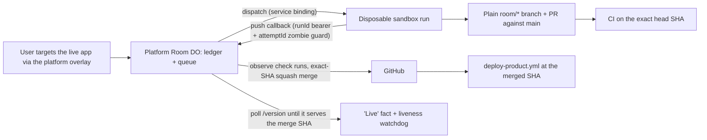

# Architecture

## Three code surfaces

| Surface | Owns | Does not own |
| --- | --- | --- |
| `platform/` | Room Durable Object (append-only ledger, FIFO build queue, reconciler), session identity, GitHub App capability, deploy observation, the authoring overlay, the frozen fallback UI | Product presentation |
| `platform/runner/` | One disposable sandbox container per run: clone, bounded coding agent, local tests, push, PR, push-based completion callback | Merge authority, CI reads, deploys |
| `product/` | The self-modifiable room UI (HTML/CSS/client) served by its own Worker | Durable state, ledger access, the overlay, deploy rails |

The product Worker has ZERO Durable Object bindings and no ledger access: it proxies the narrow HTTP surface and room WebSocket to the platform over a service binding and serves its own static UI. The platform is frozen by the CI firewall — agent branches (`room/*`) can only change `product/`.

## Runtime flow

The Room DO is the workflow ledger and realtime broadcaster. Requests become intents; an intent whose 10-second cancel window elapses is enqueued as a run; the level-triggered reconciler (alarm-driven, re-reading durable state every cycle, never trusting why it woke) dispatches one run at a time, observes CI mechanically, squash-merges at the exact verified head SHA, and completes the run only when the product's `/version` endpoint is observed serving the merged revision. Every waiting phase has a TTL that parks the run honestly. Park events queue a case for the Doctor — a schema-constrained model consult whose only levers are `stay-parked` or one `retry-once`; every failure fails open to park-for-human. Full phase semantics: [Pipeline lifecycle](./pipeline.md).

The dispatch carries the intent's verbatim evidence (request text, requester, every annotation payload) plus the requester's explicit build mode (`standard` | `fast`). Mode tunes only the agent's own budgets — never the gates, the firewall, or CI — and the system never downgrades a run on its own. Before pushing, the builder runs a self-check against the verbatim request (standard mode may iterate once on what it finds; fast checks in text only).

GitHub webhooks are HMAC-verified pokes that pull the reconciler forward and decide nothing. The runner reports by push with the per-dispatch runId as bearer credential and the attemptId as zombie guard. The daily spend budget is enforced at dispatch.

## Identity

The platform mints signed HttpOnly session cookies (HMAC keyed off the ADMIN_TOKEN secret); the room WebSocket requires a valid session, and the worker forwards only the verified identity to the DO. The GitHub App private key lives only in the platform Worker's secrets; the runner receives a short-lived installation token per dispatch.

## Data boundaries

Messages, intents, and ledger events are individual Durable Object records with monotonic sequences; reconnects load one page and live changes broadcast as deltas. Target envelopes contain stable anchors, a label, and viewport geometry — no form values, no credentials, no arbitrary DOM serialization.
